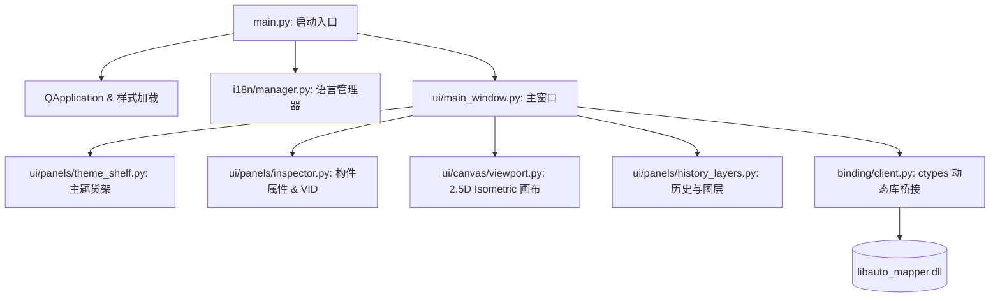

# Auto Mapper GUI 重构实现计划 (Implementation Plan)

## 1. 方案目标

本项目旨在彻底重构原有的 Tkinter 简易 Demo 界面，利用 **PySide6 (Qt6 for Python)** 库构建一个拥有**现代暗黑科幻风格、高性能、低臃肿度**的关卡地图编辑器界面。

重构的核心理念是**“所见即所得、极度直观、不藏在犄角搁旯”**，即使没有玩过《孤胆枪手》的用户也能凭借大预览图和大字卡片一眼选对材质；同时通过合理的 Python 包架构拆分和极简的 JSON 多语言（I18n）系统，保持整体软件的清爽和高可维护性。

---

## 2. 系统包架构设计 (`src/python_ui`)

重构后的 Python 层将摒弃单文件 `main_ui.py`，采用高内聚、低耦合ui的模块化包架构：



### 📁 目录结构树

```
src/python_layer/
├── __init__.py
├── main.py                     # 程序入口，负责初始化 QApp、应用 QSS/样式
├── config.py                   # 全局静态配置 (网格常量、DLL 路径、默认缩放等)
├── i18n/                       # 多语言管理模块
│   ├── __init__.py
│   ├── manager.py              # 语言管理器 (LanguageManager 单例)
│   ├── zh_CN.json              # 中文语言包 (包含菜单、面板、工具的 KV 键值对)
│   └── en_US.json              # 英文语言包
├── binding/                    # C++ DLL 的 ctypes 绑定层
│   ├── __init__.py
│   ├── structures.py           # ctypes 结构体定义 (CSegment, CDoor, CStandardDoorZConfig)
│   └── client.py               # AutoMapperLibClient: 封装 DLL 加载与底层 C++ 算法通信
├── ui/                         # 界面组件
│   ├── __init__.py
│   ├── main_window.py          # 主窗口 QMainWindow，组装工具条、视口及可停靠面板
│   ├── canvas/                 # 画布绘制模块
│   │   ├── __init__.py
│   │   ├── viewport.py         # Canvas 绘图控件，处理平移缩放、2D与2.5D Isometric 绘制
│   │   └── math_projection.py  # 2D 逻辑点与 2.5D 轴测绝对物理坐标的数学换算公式
│   ├── panels/                 # 功能停靠面板
│   │   ├── __init__.py
│   │   ├── theme_shelf.py      # 【重点】主题组合大货架 (大字+大图，卡片网格列表)
│   │   ├── inspector.py        # 【重点】合并墙/门构件属性配置区 (选择墙体/门A/门B，配大预览图)
│   │   ├── history_layers.py   # Undo/Redo 历史链与图层显示控制
│   │   └── generate_modal.py   # 生成地图的编译仿真控制台
│   └── styles/                 # 界面主题与样式
│       ├── __init__.py
│       └── dark_theme.qss      # 暗黑科幻 QSS 样式表 (带半透明毛玻璃与霓虹高亮边框效果)
```

---

## 3. 多语言 (I18n) 架构设计

为了实现“功能先进但不臃肿”，多语言系统不采用复杂的 Qt 原生 `.ts` / `.qm` 编译流程，而是开发一个基于 Python 内建 `dict` / `json` 的轻量级**运行时翻译器**：

### 🛠️ 核心代码逻辑模拟：

```python
# i18n/manager.py
import json
from pathlib import Path

class LanguageManager:
    _instance = None
    
    def __new__(cls):
        if cls._instance is None:
            cls._instance = super(LanguageManager, cls).__new__(cls)
            cls._instance.current_lang = "zh_CN"
            cls._instance.translations = {}
            cls._instance.load_language(cls._instance.current_lang)
        return cls._instance

    def load_language(self, lang_code: str):
        self.current_lang = lang_code
        file_path = Path(__file__).parent / f"{lang_code}.json"
        try:
            with open(file_path, "r", encoding="utf-8") as f:
                self.translations = json.load(f)
        except Exception as e:
            print(f"Error loading language {lang_code}: {e}")
            self.translations = {}

    def translate(self, key: str, default: str = "") -> str:
        # 支持点语法查找，例如 "menu.file.new"
        keys = key.split('.')
        data = self.translations
        for k in keys:
            if isinstance(data, dict) and k in data:
                data = data[k]
            else:
                return default or key
        return str(data)

# 全局极简翻译函数
def _(key: str, default: str = "") -> str:
    return LanguageManager().translate(key, default)
```

### 📝 语言包 JSON 文件范例 (`zh_CN.json`)
```json
{
  "window_title": "Auto Mapper 关卡地图编辑器",
  "menu": {
    "file": {
      "title": "文件 (F)",
      "new": "新建地图",
      "import": "导入 JSON",
      "export": "导出 JSON",
      "compile": "生成并导出 .MAP"
    }
  },
  "themes": {
    "lab": "🧪 实验室风格 (Lab Green)",
    "base": "🔩 军事基地 (Military Base)",
    "city": "🧱 城市街区 (City Ruin)"
  },
  "components": {
    "wall": "🧱 墙体主体 (Wall Body)",
    "door_a": "🚪 标准安全门 (门 A)",
    "door_b": "🔒 激光防爆门 (门 B)",
    "prop": "🏮 装饰物/障碍 (Other)"
  }
}
```

---

## 4. UI 核心重构要点

### 🌟 4.1 风格主题大货架 (`theme_shelf.py`)
* **视觉设计**：平铺三个巨大的材质组合卡片（Lab 实验室、Base 军事基地、City 城市街区）。
* **资源展示**：每个卡片包含一张高清的 Isometric 大缩略图，大字标题和对风格的直观人话解释（“生锈铁板，适合关卡前期”）。
* **点击交互**：点击任意大卡片后，激活该场景组合，且右侧细分部件列表自动联动，且画布网格底色也实时过渡变色（绿/蓝/黄），带霓虹呼吸灯状态。

### ⚙️ 4.2 细分构件 Inspector 属性面板 (`inspector.py`)
* **墙门合并**：顶部的下拉菜单不再是单纯 of 参数，而是提供在当前大主题下的**子构件选择**（墙体 / 门 A / 门 B / 其它装饰）。
* **大图图鉴**：当下拉菜单选择 “激光防爆门” 时，展示该部件的大图预览，解决“没玩过游戏的人看不懂英文名和VID”的困扰。
* **VID 细节表**：底部直观显示主资源 VID、侧边 VID、转角 VID 等纯文本信息，免去用户手动填写的麻烦。

### 🌐 4.3 2.5D Isometric 轴测网格画布 (`viewport.py`)
* **绘制架构**：基于 PySide6 的 `QGraphicsView` 或直接重写 `QWidget`。由于需要绘制 2.5D Isometric 轴测斜线网格，我们将利用物理坐标投射公式，在画布上画出精准的 40x28 物理等距网格线。
* **平移缩放**：原生拦截中键拖拽和滚轮事件，支持画布流畅无死角的视口变换。

---

## 5. 校验计划 (Verification Plan)

### 5.1 自动化测试
* **C++ API 测试**：运行 C++ 模块单元测试，确保 `libauto_mapper.dll` 正常生成，导出的坐标换算数据不退化。
* **I18n 包自检**：运行测试脚本对 `zh_CN.json` 和 `en_US.json` 的 Key 集合进行比对校验，防止多语言翻译缺失。

### 5.2 手动测试
* **双语切换测试**：在顶栏菜单切换中文/英文，验证整个界面（包括大材质卡片描述、下拉框选项、状态栏）瞬间平滑切换，无字符截断。
* **绘制流程闭环**：
  1. 打开程序，在左侧大卡片选择“Lab 实验室”主题；
  2. 右侧选择“激光防爆门 (门 B)”；
  3. 在 Canvas 的 2.5D 倾斜网格上放置门；
  4. 点击 F5 唤起生成窗口，查看调用 `libauto_mapper.dll` 是否编译出完好的 `ui_output.map` 文件；
  5. 导入游戏或用原版编辑器打开生成的地图，验证墙体材质和门 VID 渲染正确无误。
